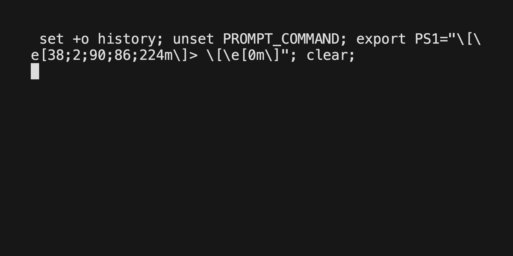

# Algorand Loyalty Demo
A loyalty reward program built for the Algorand ecosystem. This allows an adminstrator
to create and assign a offer to a "customer" or member of the loyalty program. This is
a submission for the Customer Loyalty App task in the Algorand Greenhouse Hack 2 Hackathon.

## Design

The design of the loyalty program is mostly broken into the PyTeal smart contract. This
allows for more flexible development of how the offer contract actions can be fufilled.


## Development Setup

This repo requires Python 3.6 or higher. We recommend you use a Python virtual environment to install the required dependencies.

Set up venv (one time):

    python3 -m venv venv

Active venv:

    . venv/bin/activate (if your shell is bash/zsh)

Install dependencies:

    pip install -r requirements.txt

### Running Test

- First start an instance of the [sandbox](https://github.com/algorand/sandbox) (requires Docker): `./sandbox up -v`
- Run `pytest`
- After the test is done you can spin down the sandbox: `./sandbox down`

Example Test Run:

### Running the example script

There is currently an example script that shows how an offer could be assigned to a 
member/customer address and they can "perform" an action, which satisfies the offer condition
and they recieve a reward. 




## Example Use Case

Imagine that you want a loyalty memeber to sign-up for your loyalty program and once they
have done so you want them to join your Discord server and post an intro message. This would
be difficult for a smart contract to communicate with external resources (i.e. an custom sign-up and
discord oracle). So the smart contract has the concept of a "action_id" that is managed by
the contract creator. 

So in our example we could create and manage a couple of `action_id`'s:

```
sign_up_action_id = 101
join_discord_and_post = 102
```

We could then create a couple of offers for each action for a loyalty member. Once the offer
is created an "action manager" application can keep track of the action(s) a member needs to
accomplish. This could be connecting to 3rd party APIs or connecting to a Database. Once the
action manager determines that the correct action has been accomplished it can then call the
"completeAction" contract application call to complete the offer and pay out the reward to 
the loyalty member.

## LICENSE

MIT